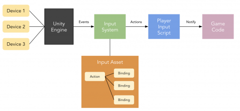

+++
title = 'Spit It Out - Week 11 Devlog'
date = 2023-11-01T14:46:30-05:00
draft = false
tags = ['devlogs', 'spit it out', 'programming']
series = [ "Spit It Out Devlog" ]
series_order = 6
showDate = true
showDateUpdated = true
showHeadingAnchors = false
showPagination = false
showReadingTime = true
showTableOfContents = false
showTaxonomies = false 
showWordCount = false
showSummary = true
sharingLinks = false
+++

Programming
------

This week I focused my attention mostly on getting Two Player Co-Op working with Split Screen. While initially, this might not seem too complicated, it most certainly proved itself otherwise. This comes down to the way Unity's New Input System handles spawning players and connecting those players to specific characters. 

To control a character with a specific device, you need something called a Player Input Component. Normally when not working with co-op, if you were to plug in a compatible controller to your game, Unity would handle this on its own in the backend by searching for the Player Input Component in the scene and then pairing it with the device it has listed. This is simple enough, but problems arise when you have multiple controllers of the same type. How does Unity know which Controller to pair to each Player Input Component? It doesn't. 

The way that Unity gets around this is with the Player Input Manager Component, which spawns in Set Prefabs that have the Player Input Component on them when it detects input from a viable controller. Unity handles the pairing of devices to Player Inputs on its own, which on one hand is nice, but on the other can be rather frustrating when you want to specify it yourself. Additionally, these pairings do not carry over from scene to scene, and with the way that Unity handles Split Screen currently, nothing would be displayed on the screen until a Player Input is spawned. 

My job was to figure out how to have the players 
1. spawn themselves in 
2. Store the data of the controllers and the control schemes for each player
3. Have the players select which character they want to play as
4. Carry that information over into the next scene. 

This took quite a bit of time, and I encountered numerous bugs in attempting to find the solution such as multiple players being spawned, the split screen only showing one player, and the players not spawning at the correct spawn points determined by the developers. 

In the current system, [it works quite nicely](https://drive.google.com/file/d/17tpRvMw3PoEBYdRHwu6K1bLbZgbigIat/view), though I have some concerns about how I will continue this implementation after the players have finished the level and return to the Level Select screen. 

Bug Fixing & QA
------

In addition to this, I also tackled and solved numerous bugs. Some examples include: 

- Fix Slider, Crank, and Button not acting properly with Gadgets
- Fixed Gadgets not returning to their original state when the Gizmo is removed
- Fixed a small bug of interacting with a Value Change Gizmo not always registering
- Fixed a bug of a Player being able to put down a gizmo without being near a wire
- Fixed a bug of the player being able to move while interacting with a gizmo
- Fixed rotating and slider values being shared among players

My current task involves setting the Respawn system up so that it works for the Co-Op controllers. While my respawn system works for a single player, I have encountered some bugs with making it work for Co-Op players. I'm hoping to have this fixed by the end of the day. 


Don't forget to check out [our demo](https://chknlee.itch.io/spit-it-out) on Itchio.
