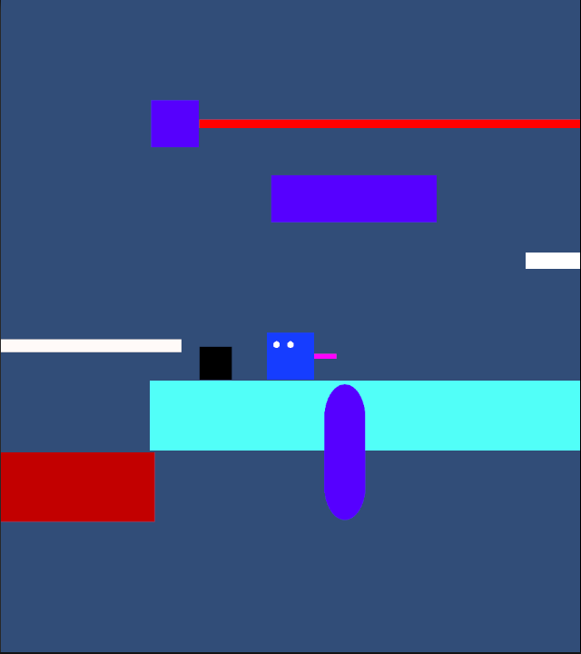
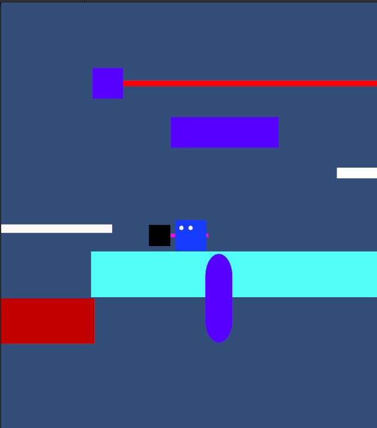

+++
title = 'Spit It Out - Week 12 Devlog'
date = 2023-11-08T14:46:30-05:00
draft = false
tags = ['devlogs', 'spit it out', 'programming']
series = [ "Spit It Out Devlog" ]
series_order = 7
showDate = true
showDateUpdated = true
showHeadingAnchors = false
showPagination = false
showReadingTime = true
showTableOfContents = false
showTaxonomies = false 
showWordCount = false
showSummary = true
sharingLinks = false
+++

Bug Fixing & QA
------

For this devlog cycle, the vast majority of my time was spent putting out fires in the form of bug fixing and major feature tweaking to better suit the level designers to have a build of the game ready. Some of the larger bug fixes included making sure players could not phase through platforms, could jump on seesaws, and numerous physics-related issues. I also provided [tech support](https://drive.google.com/file/d/1e1fj3gfChkuXhseHQ8HjvmJQQniCnZKU/view?usp=sharing) for things such as helping the level designers test their levels and implement various gadgets and gizmos. 

Programming
------

I also created a couple of new features such as being able to pick up weighted blocks and put them back down, new procedural animations for the Gadgets, and a Level Manager that will send the player back to the Main Menu once they have reached the end of the level. 

For the next dev cycle, I will be working extremely hard on adding the remaining few features we need such as a water level system, along with smaller systems that I feel truly improve the overall design of the game. This includes things like a death animation, various particle effects, scene transitions, and a better Gizmo Selection UI that is based in the world as opposed to the canvas. I will of course be galavantly leading the charge against the bug infestation that will arrive in due time and will be sworn to vanquish as many as I can in my dying breath. 


Don't forget to check out [our demo](https://chknlee.itch.io/spit-it-out) on Itchio.
