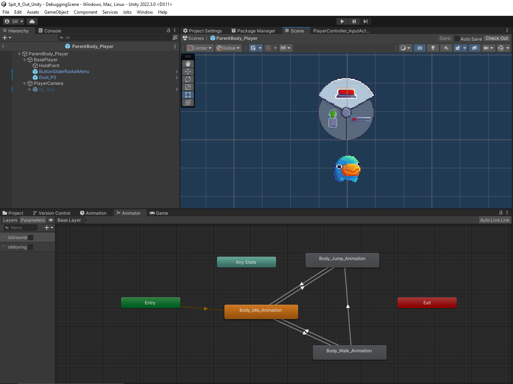
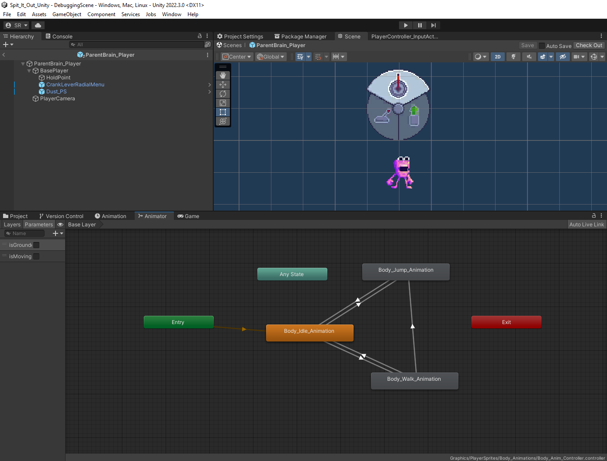

+++
title = 'Spit It Out - Week 13 Devlog'
date = 2023-11-15T14:46:30-05:00
draft = false
tags = ['devlogs', 'spit it out', 'programming']
series = [ "Spit It Out Devlog" ]
series_order = 8
showDate = true
showDateUpdated = true
showHeadingAnchors = false
showPagination = false
showReadingTime = true
showTableOfContents = false
showTaxonomies = false 
showWordCount = false
showSummary = true
sharingLinks = false
+++

Programming
------

During this devlog cycle, I began the (rather fun) process of implementing sprites and animations for the player characters, along with the new radial UI for selecting gizmos. This involves taking the sprite sheets that were made by others and importing them into unity to create Animation Controllers for each character. Controllers are Unity's way of containing a set of animations and then allowing you to transition from those animations based on a set of criteria that you can toggle in your scripting. Things like the Idle animation only playing when the player's velocity is 0, or the Jump animation playing when it detects a successful jump have been requested. 

In addition to this, I also implemented the radial menu animations and controls. The new system will pop up when the player is within interact distance of a wire. Tapping the Right Shoulder button will move the menu between their different gizmos along with the remove button. I also implemented Assets and Animations for various other things such as the [Main Menu](https://drive.google.com/file/d/1G851xS5oP1-sKAieJGvlAGVI-SQi2pM7/view?usp=sharing), Level Select, Jump Particles, Explosion Particles, and a few other minor things.

Bug Fixing & QA
------

The other main thing I focused on was Bug Fixing along with a few minor feature Updates. This includes things such as removing the old radial menu, being unable to jump while on the seesaw, weight objects not respawning when the player dies, weights moving as though possessed when picked up or dropped, adding basic particle effects for certain events, prioritizing the weight when picking it up off of the button, wall jumping being possible, and the player being able to double jump


Don't forget to check out [our demo](https://chknlee.itch.io/spit-it-out) on Itchio.
