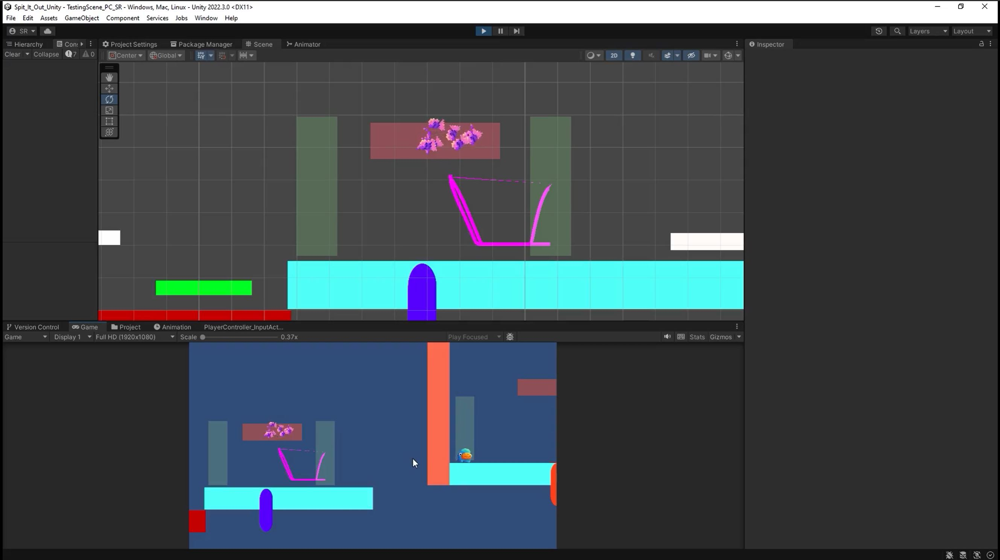

+++
title = 'Spit It Out - Week 14 Devlog'
date = 2023-11-22T14:46:30-05:00
draft = false
tags = ['devlogs', 'spit it out', 'programming']
series = [ "Spit It Out Devlog" ]
series_order = 9
showDate = true
showDateUpdated = true
showHeadingAnchors = false
showPagination = false
showReadingTime = true
showTableOfContents = false
showTaxonomies = false 
showWordCount = false
showSummary = true
sharingLinks = false
+++

Bug Fixing & QA
------

This week I continued work on fixing bugs such as: 

- Not being able to prioritize picking up the weight on a button
- The player slides off into nothingness when they are moving and press the interact button
- Being unable to do a long jump on a platform that is rotated
- Redesigning the weight box (again) to fix the needs of the developer
- Fixed player being able to die repeatedly in an endless loop
- Reset the orientation of characters when respawning so that they do not have to complete the level at 90 degrees
- Orient gizmos to the wall's rotation

Programming
------

In addition to this, I also continued work on implementing assets such as the Sprites for the Gizmos, along with attempting to implement graphics for the Parallax Background. The Backgrounds are not quite where we want them yet and require more tinkering. Additionally, I also created a [death sprite animation event](https://drive.google.com/file/d/1jWazq2gig9q9wY-4eqAmFdy76tW87t1B/view?usp=sharing) whenever the player falls onto a hazard. The sequence consists of the player exploding into chunks, the camera holding on to it for a few moments with an audio blip playing, and then the player respawning and the camera reattaching itself to them. I feel that this adds to the comedic effect the game is playing with the co-op since everyone loves to kill their friends in co-op games. 


Don't forget to check out [our demo](https://chknlee.itch.io/spit-it-out) on Itchio.
