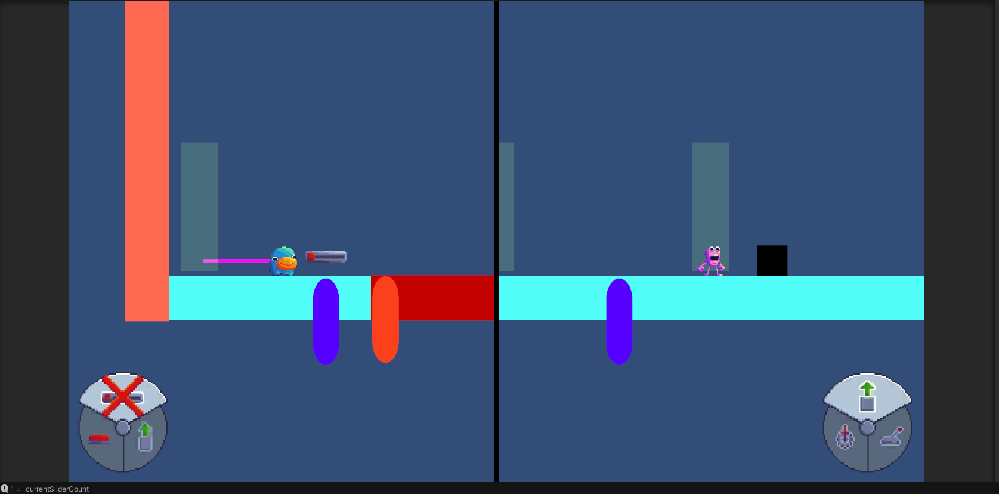

+++
title = 'Spit It Out - Week 15 Devlog'
date = 2023-11-29T14:46:30-05:00
draft = false
tags = ['devlogs', 'programming', 'on-going']
series = [ "Spit It Out Devlog" ]
series_order = 10
showDate = true
showDateUpdated = true
showHeadingAnchors = false
showPagination = false
showReadingTime = true
showTableOfContents = false
showTaxonomies = true 
showWordCount = false
showSummary = true
sharingLinks = false
+++

Programming
------

This devlog cycle was partly broken up by Thanksgiving break, where I was barred from my family from doing work. So I wasn't able to do as much as I normally would. But regardless, I was still able to accomplish some of the more urgent tasks. I continued squashing out bugs here and there where they popped up during playtesting, including but not limited to: 

- Reset Orientation when respawning
- Reset Momentum and Physics when respawning
- Prevented bug where player fell through the floor
- Box gets stuck in the wall when the player lets go of it

Additionally, the major overhaul that I did was remaking the Radial Gizmo system to have a Split Canvas with the radial wheel always being available and seen. This fixed a couple of bugs with the radial menu not popping up and not being accessible in certain areas, while also being more convenient from a gameplay perspective. I also created a [new system](https://drive.google.com/file/d/1MxYX1PmRN5Mx0jXNB2f5_QSXNGH8RgHo/view?usp=sharing) and set of animations to show the player when they are out of a certain gizmo. 

This also involved creating the Limited Gizmo's system, where players only have a max count of 1 per gizmo. When they place down a specific gizmo, they cannot place another of that type down until they remove it. In addition to this system, I also created a prefab that when the player passes through it, they will retain all of their previously spent gizmo, and the gadgets they were attached to will return to their original state. 

This week I need to finalize the Tutorial System for the first level, along with more minor things like the Parallax background, Game Settings, and UI to better communicate to the player where they need to stand to interact with the Gizmos. 


Don't forget to check out [our demo](https://chknlee.itch.io/spit-it-out) on Itchio.
