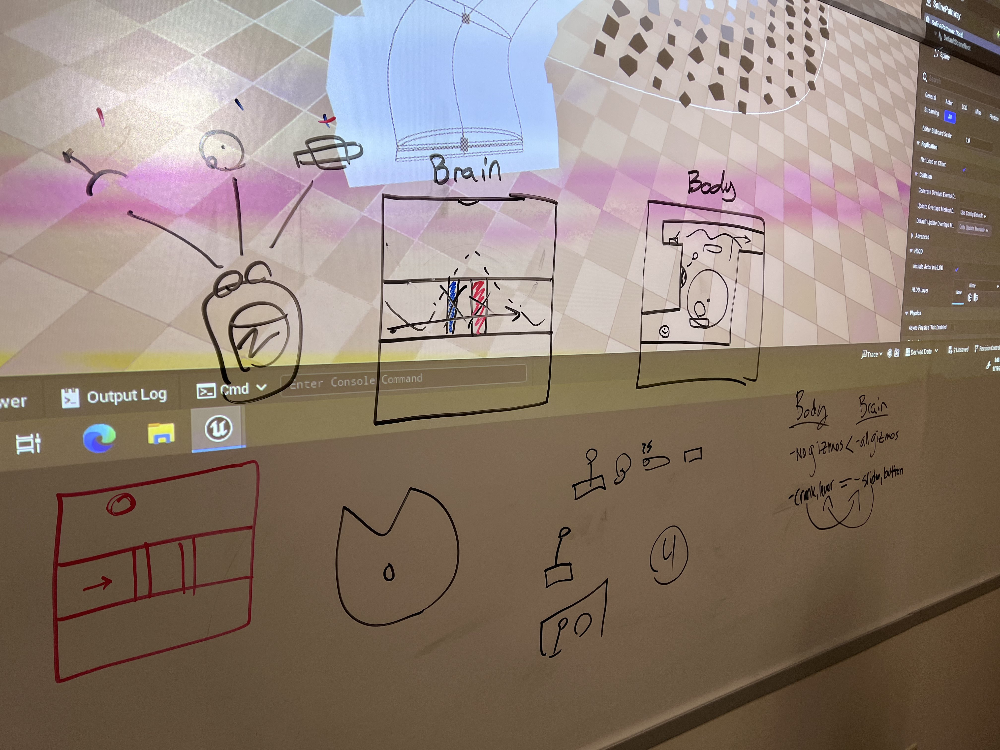

+++
title = 'Spit It Out - Week 6 Devlog'
date = 2023-09-27T14:46:30-05:00
draft = false
tags = ['devlogs', 'spit it out']
series = [ "Spit It Out Devlog" ]
series_order = 1
showDate = true
showDateUpdated = true
showHeadingAnchors = false
showPagination = false
showReadingTime = true
showTableOfContents = false
showTaxonomies = false 
showWordCount = false
showSummary = true
sharingLinks = false
+++

Game Design
------

Working with Grayson and William, we went through many different iterations of what the gameplay loop would be between the two players. The main concern was ensuring that each player had equal footing and responsibility in their goals and duties, while also ensuring that no player would be waiting on the other player for an extended period. We went back and forth on a few different ideas, but this usually resulted in either the 'Brain' or the 'Body' having more interesting things to do, but not both simultaneously. In coming up with a new gameplay loop, we set out these main goals: 

1. No player should be waiting on the other player for more than around 5 - 10 seconds
2. Both players should be held equally accountable for their actions. No one player should be blamed for a mistake
3. Both players must affect the other player's gameplay to maintain co-op
4. The gameplay loop must be simple to understand and fun to iterate upon

After more brainstorming, Grayson and I came up with a new gameplay loop. Using the Gizmos (Lever, Crank, Button, Slider) from previous iterations, we create a system where each player would be able to control their own Gizmos. Both the Brain and the Body would be traversing through their own puzzle platformer but would require the other player to perform certain actions on their side to continue forward. Each player would have Wires on their side of the level which would be color-coordinated to match to various elements of either their level or the other player's level (A purple wire would do something to the purple door). The main gameplay loop comes from placing Gizmos on these Wires, figuring out what effect these cause, and then coordinating with one another to traverse through the level.

This solves all of the aforementioned goals that we were struggling with. It makes the coordination feel more like a two-sided conversation, with each person contributing their own logic and abilities to solving the puzzle, without one person doing all the work. Both players are held equally accountable since they have their own unique tasks, both are affecting the other player's gameplay and are doing so in a fun loop that (while perhaps difficult for our level designers) can be iterated upon in future levels. 

Programming
------

For this project we are using Unity (2022.3.0f1), due to this engine being the most familiar to the group and because Unity allows for very quick prototyping which is essential in the early stages. For this week, after setting the project up on Perforce, I began work on creating the basic Player Controller. From the start, I wrote down a few different goals I wanted to have for this player controller.

1. PC Feels good to move
2. Includes a Jump Buffer
3. Includes Coyote Time
4. Variable Jump Height
5. Variable Attributes that can be tested and tweaked by the Editor

I researched other 2D Platforms such as Celete, Super Meat Boy, and a few others to get a good sense of why their controls feel so good to play, and from that came the aforementioned goals. 

I am using the New Input System from Unity for this project, allowing me to have multiple different controllers whether that be a Keyboard, Gamepad, or a combination of the two. 

This was then set up with Custom Unity Events in a Player Input Script to allow for Jumping and basic movement. The Player Controller uses a Rigidbody2D, along with a Box Collider and Edge Collider. This allows me to be able to specify variables such as Gravity Modifiers, Max Velocity, and Friction.

With this, I was able to set Serializable Variables in the Inspector for outside developers to mess with to find the right feel for the Characters. 

- Jump Height indicates the highest a character can jump
- Max Air Jump allows players to redirect themselves better while in the air (Also serves as a double jump if necessary)
- Downward Movement Multiplier is the gravity modifier used when the player is making a descent
- Upward Movement Multiplier is the gravity modifier used when the player is actively jumping
- Coyote Time refers to allowing the player to still access the Jump action a few seconds after they have left the Ground.
- Jump Buffer Time refers to the action of Queuing up a Jump action if a player has requested it a few seconds before being officially on the ground. 

With this, the Basics of the Player Controller involving Movement and Jumping are complete. Of course, iteration and improvements will continue to happen throughout development, but this will provide us with an excellent starting point to move development forward for testing. 

Split Screen, along with an improved 2 Player Management System will be forthcoming. Next Sprint will involve creating and implementing the Gizmo System. 


Don't forget to check out [our demo](https://chknlee.itch.io/spit-it-out) on Itchio.
