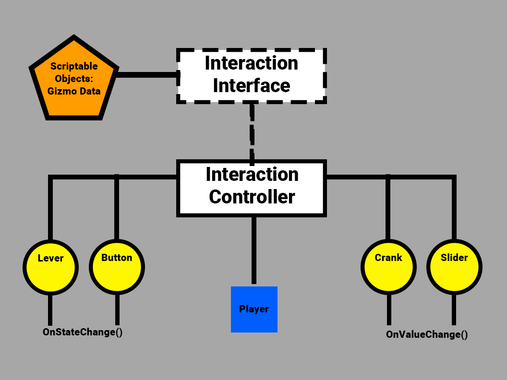

+++
title = 'Spit It Out - Week 7 Devlog'
date = 2023-10-04T14:46:30-05:00
draft = false
tags = ['devlogs', 'spit it out', 'programming']
series = [ "Spit It Out Devlog" ]
series_order = 2
showDate = true
showDateUpdated = true
showHeadingAnchors = false
showPagination = false
showReadingTime = true
showTableOfContents = false
showTaxonomies = false 
showWordCount = false
showSummary = true
sharingLinks = false
+++

Programming
------

This week I began work on what will most likely be the most complicated system in our game, the Gizmo system. The Gizmo system encompasses all of the 4 different interactable gizmos (Lever, Button, Crank, and Slider), their unique input systems, the Wire system (gizmos only affect certain colored wires), along with the necessary Interaction Controller System for the player to be able to interact with them in the first place. It is a multi-step, complex task that has thus far required quite a bit of planning on my end to determine the best way to do this. 

The first thing to tackle was the Interaction system itself. I could need to create a system that had a solid base that could be implemented into various classes that could encompass things potentially outside of the gizmos (e.g. keys, collectibles).

I created an Interface (represented by the dotted cube) for the Interaction system. An Interface is not an instantiable class, but rather, it is a collection of properties and methods that serve as a skeleton for classes to inherit from. Those classes are then required to implement those properties and methods. This is useful as it makes it so that we do not have to inherit from a class that has very little to do with what we really need and standardizes functionality across a set of systems. 

This interface is then derived in our InteractableBase which sets and contains properties and methods such as the HoldDuration, whether or not an Object is Interactable, and whether it can be used multiple times. This interactable base is then placed on each of the Objects that we wish to interact with, which is then referenced by the Interaction Controller the Player Character is utilizing. The InteractableBase also makes use of ScriptableObjects: a data container that allows us to save data independent of class instances. We store our Gizmo Data in these scriptable objects which then gets fed to the Interaction Controller. 

These Gizmos then call upon specific methods that relate to their category. The Lever and Button are boolean, either being in the Up or Down position, while the Crank and Slider are floats with every changing value in a range. 

The Interface, Gizmo Data, and Interaction Base are all complete, but the Interaction controller currently only has pseudo-code and needs to be fully implemented and tested. 

Finally, in order for functionality in the Interaction Controller to be correct, I updated the Player Input Controller to change the direction of the Sprite Depending on which way the character is moving. 

The Input Controller now has two new boolean values: Spawn Facing Left & Spawn Facing Right. Depending on which boolean is triggered, the Player will spawn either facing the left direction or the right direction. The Scale.x value of the player is then swapped between -1 and 1 depending on which direction they are moving. Ideally, these should be set in the future Level Controller script, but works fine here for now. 

This week I will continue implementing the Interaction and Gizmo system, and will hopefully have the entire system complete by the end of the week. 


Don't forget to check out [our demo](https://chknlee.itch.io/spit-it-out) on Itchio.
