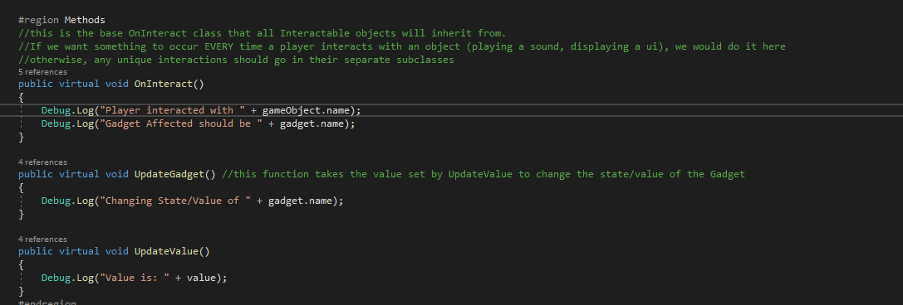
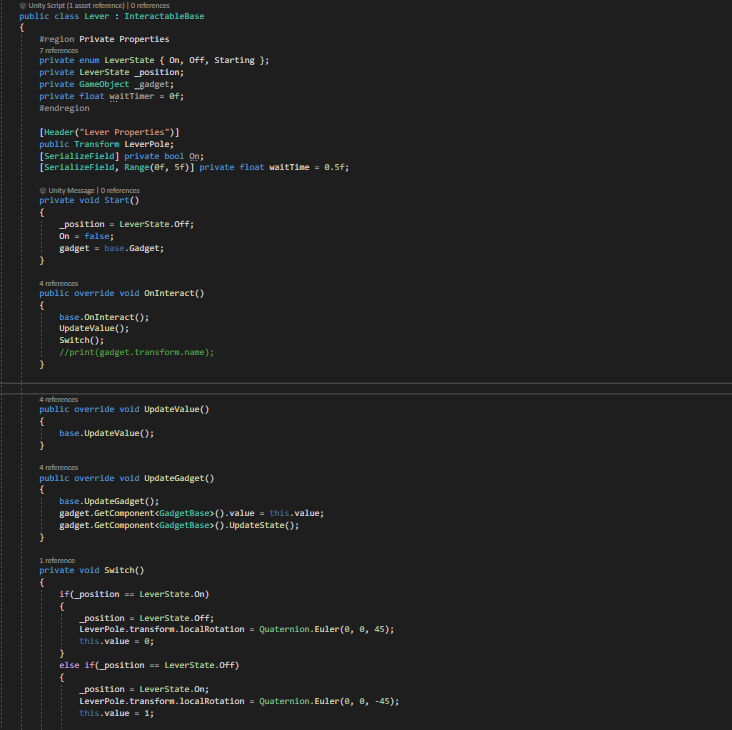
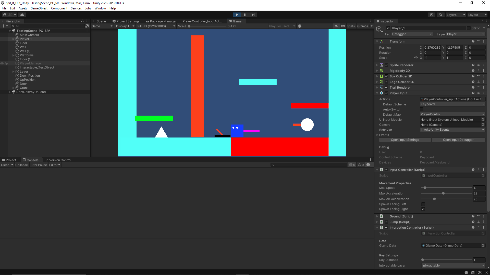
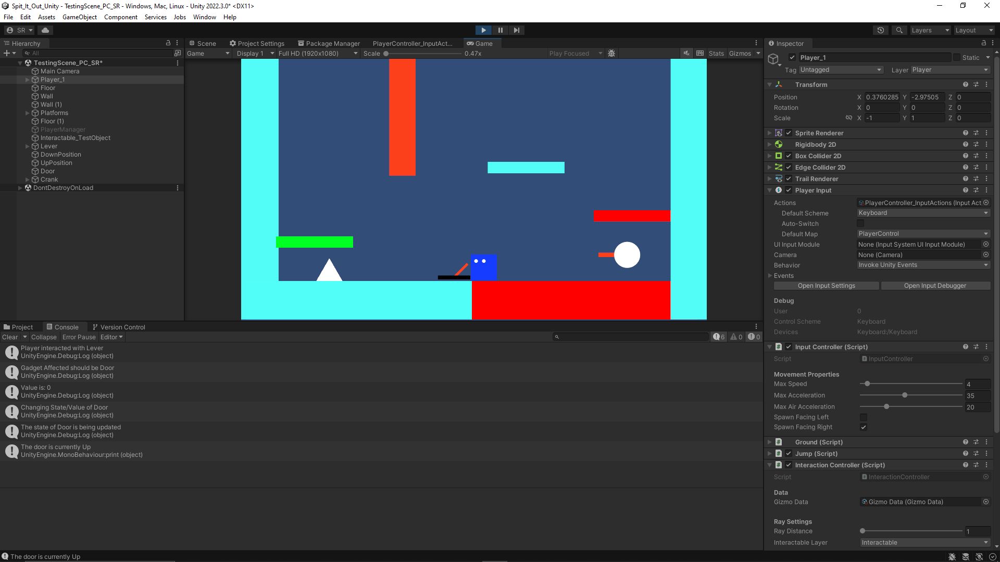

+++
title = 'Spit It Out - Week 8 Devlog'
date = 2023-10-21T14:46:30-05:00
draft = false
tags = ['devlogs', 'spit it out', 'programming']
series = [ "Spit It Out Devlog" ]
series_order = 3
showDate = true
showDateUpdated = true
showHeadingAnchors = false
showPagination = false
showReadingTime = true
showTableOfContents = false
showTaxonomies = false 
showWordCount = false
showSummary = true
sharingLinks = false
+++

Programming
------

I continued my work on implementing the Interaction System which will be vital in implementing the various gizmos and "gadgets." gizmos refer to the 4 main objects the two players will be interacting with (Lever, Button, Crank, Slider), and Gadgets refer to the objects that are affected by those gizmos (Door, Laser, Air Turbine, etc.) When a player interacts with a gizmo, it needs to do two main things: 

1. Retrieve data about the specific gizmo the player has interacted with and update the value of it.
2. Retrieve data about the specific gadget the gizmo will be affecting and update it with the given value from the gizmo.

All gizmo objects inherit from a base Parent known as InteractableBase. This class sets up the needed functions for what is required in Step 1. It sets up an interaction event and then updates its value based on that specific interaction event. It then calls another function that Updates the specific gadget. 

However, we will have several different types of gizmos that all have unique attributes and characteristics. It would be better to place that logic in its separate script that inherits from InteractableBase. This keeps our code clean and organized, without running the risk of certain objects having access to things they shouldn't have. For example, in the Lever Script, it can update its value to either 0 or 1; the only two values that it can have are reflected by the Up or Down state. But in comparison, the Crank Script updates its value between a range of 0 to 1 based on the position of its child object in a 360-degree rotation. 

We then need to retrieve data about the specific gadget that we want to update given the value of the gizmo. This is done similarly to how we retrieve the gizmo: with scriptable Object. When interacting with an object, the InteractionBase searches for the gizmo data of the given object. It then populates itself with that data to perform certain functions successfully. The InteractionBase will also then have to search for the relevant gadget data based on several properties such as which wire the gizmo is attached to, and what gadget is also attached to that wire. This part of the script is still a work in progress. 

Currently, the lever gizmo and door gadget are working as intended, but more work needs to be done with the Crank. Since the Button and Slider are simply slightly different versions of the Lever and Crank, they will not take nearly as long to develop once the previous two are finished. I'm hoping to have all of this done before the 50% Sprint.


Don't forget to check out [our demo](https://chknlee.itch.io/spit-it-out) on Itchio.
