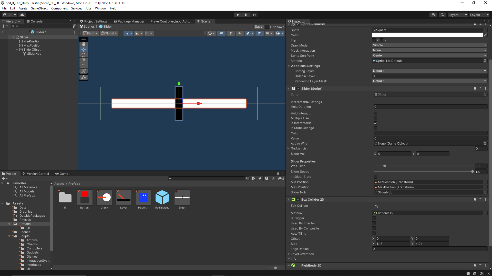
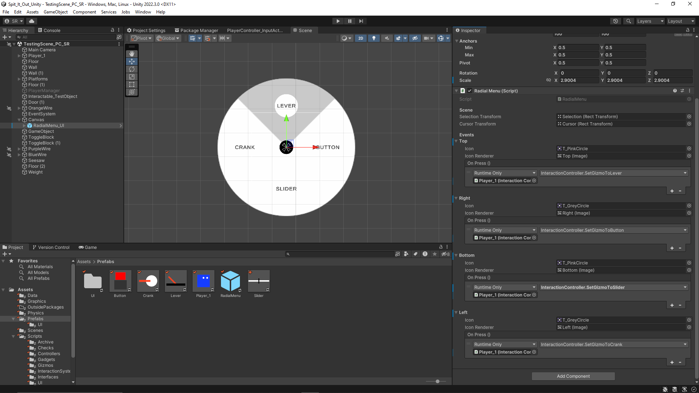
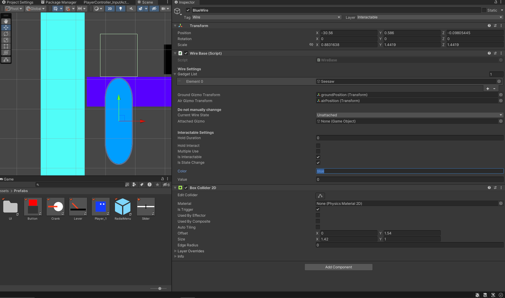

+++
title = 'Spit It Out - Week 9 Devlog'
date = 2023-10-18T14:46:30-05:00
draft = false
tags = ['devlogs', 'spit it out', 'programming']
series = [ "Spit It Out Devlog" ]
series_order = 4
showDate = true
showDateUpdated = true
showHeadingAnchors = false
showPagination = false
showReadingTime = true
showTableOfContents = false
showTaxonomies = false 
showWordCount = false
showSummary = true
sharingLinks = false
+++

Programming
------

For week 9 I finalized the systems for all the Gizmos (Crank, Slider, Button, and Lever), along with the wire system, and created some of the basic Gadgets that the Level Designers will need for the first level. 

Last week, I created the Lever and the Crank system. To be able to fully test out these Gizmos, along with incorporating them into the Wire System, I would need some sort of simple interface that allows me to choose and spawn in Gizmos. I created a radial menu that shows up when the player holds down the North D-pad key on their respective controller. Using the Right joystick, they can swivel around the different choices with a visual indicating which Gizmo they are on. The player then has to hit the North button on their gamepad to select the gizmo. That gizmo will now spawn when the player interacts with a Wire. This UI is simply a placeholder, along with the controls associated with it. I just needed something quick and easy that could be changed in the future. 

The Wire System inherits from the same InteractionBase that the Gizmos inherit from, but it also inherits from its own Class called Wire. Its data is stored in a WireData ScriptableObject similar to how the GizmoData is stored. When the player walks up to a Wire, it will grab that Wire data and check if it has a Gizmo attached to it. If it does not, then it enters into a state where the player can interact with the Wire and spawn in their selected Gizmo. Doing so will change the state of the Wire to Attached, and it will grab the data of the Gizmo that it is attached to. The Wire is no longer interactable. 

The wire stores a list of all the Gadgets that it affects. This List has to be manually set by the Developer in the Inspector. All Items stored in that List MUST have a gadget base or it will reject the Object. Once the Wire exits its interactable state, it then passes that list of Gadgets to the attached Gizmo. That attached gizmo then uses that list to update the value/state of the respective Gadgets. 

All gizmos output a value between 0 - 1. This is extremely useful as it standardizes all the Gadgets to have to take an input between 0 - 1 and use that information to update their states/values. Gizmos fall under two categories: state change and value change. State Change Gizmos are Gizmos that swap immediately from 0 to 1 or 1 to 0. Gizmos like the lever or the button fall under this category. Value Change Gizmos are Gizmos that have a gradation of values from 0 to 1 and can float between them at the player's own input. These correspond to Gizmos like the crank or slider. All gadgets have specific functions that correspond to either a State change or a value change depending on the gizmo. 

I plan to record a video going over the different GameObjects + Prefabs and how the Level Designer would use them to create their levels. This would include showing them how to set up their own Wires and Gadgets and how to link them up together. That will be posted on the Devlogs once that is up. 


Don't forget to check out [our demo](https://chknlee.itch.io/spit-it-out) on Itchio.
