+++
title = "A Short Walk to Grandma/'s"
date = 2022-04-17T13:03:09-05:00
draft = false
tags = ['Level Designer']

showDate = true
showDateUpdated = true
showHeadingAnchors = false
showPagination = false
showReadingTime = false
showTableOfContents = false
showTaxonomies = true 
showWordCount = false
showSummary = true
sharingLinks = false
+++

**Solo Developer**   (*March 2022 -  April 2022*)

Trailer
------



Summary
------

You are a young girl on her way to her grandmother's. Shouldn’t take too long, right?

Play as little red riding hood, trekking through woods, oceans, caves, dungeons, and mountains to get to grandma’s house. Watch out for strange creatures that block your way. Pick up pieces of the story to continue forward! Along the way, collect items to give to Grandma like bread, wine, and jam! There are five hidden on each level, can you find them all?

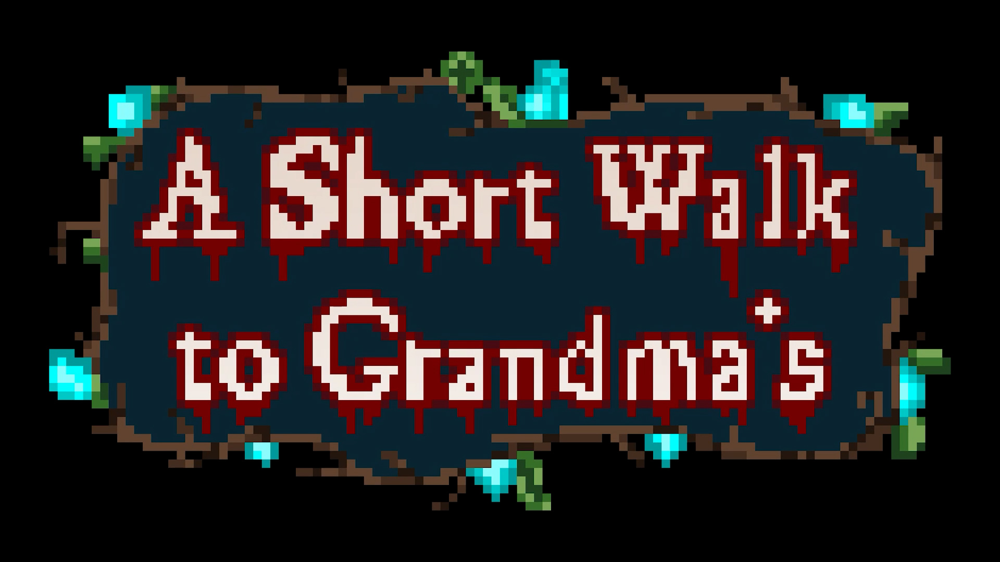

*A Short Walk to Grandma's* is a 2D platformer where you play as little red riding hood, traversing through four levels to reach your Grandma. Little Red is equipped with her trusty bow and her double jump to traverse through the dangerous jungle, coastline, castle, and forest while enemies attack you. Each level the player must find the next page to the story, along with potential collectibles hidden in each level. This game was made over the course of 1 Month and was submitted to Horizons Showcase 2022 along with being presented at GDEX 2022. 

## Development

### Level Design

While I was the solo-developer for this game, I used this game as a chance to improve my Level Design skills. The game consists of 4 levels, with a variety of enemies specific to each level being presented slowly to the player for them to test their new abiliites. 

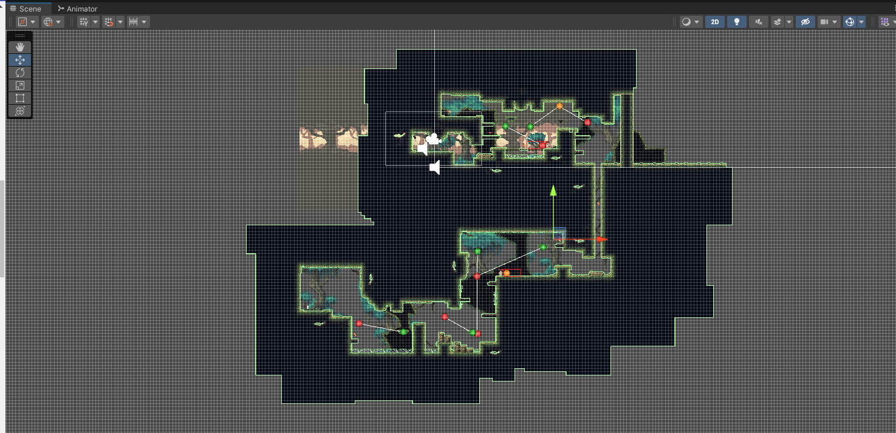
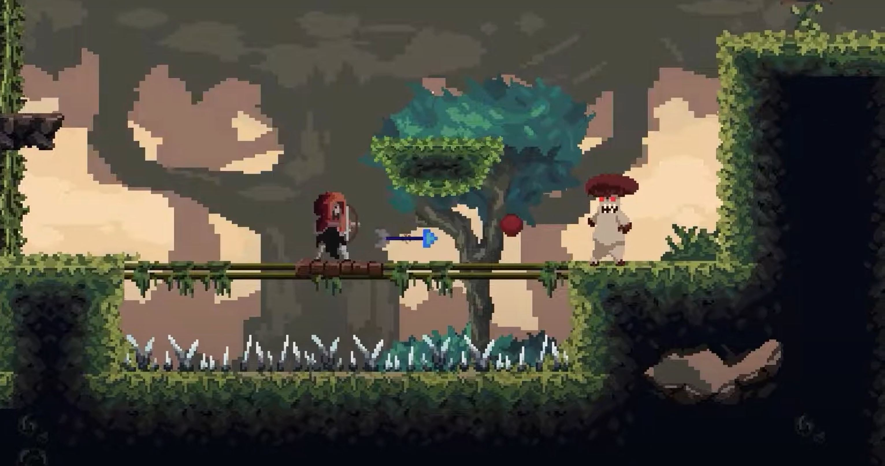

The first level, The Jungle, focuses more on allowing the player to familiarize themselves with the playforming and double jump. While there are enemies, they are projecticle enemies, standing far off for the player to dodge their attacks and retaliate with their bow. Enemies are just far enough away for the bow's arrows to hit, allowing the player to understand the distance their own attacks have. 

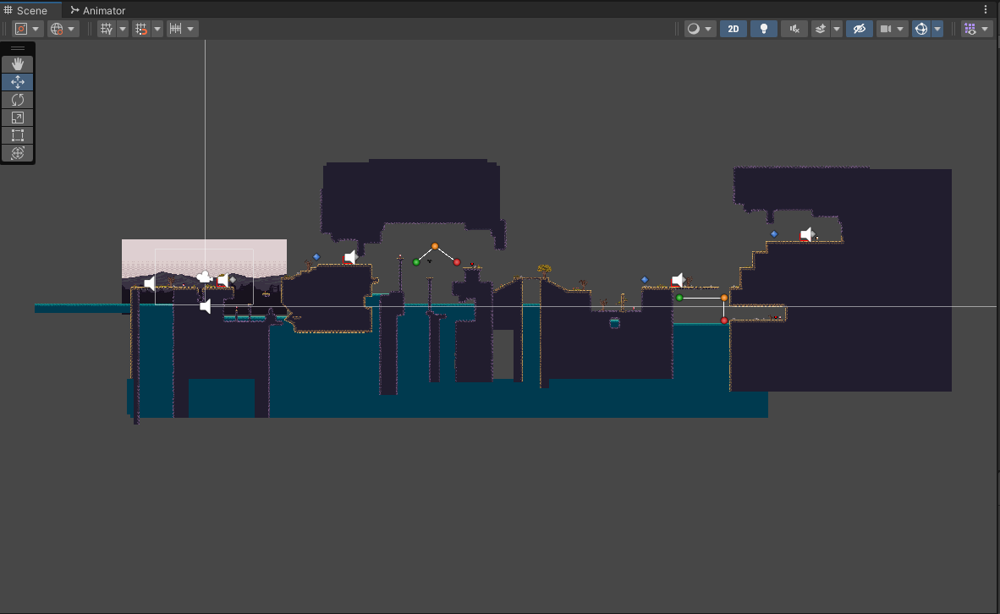

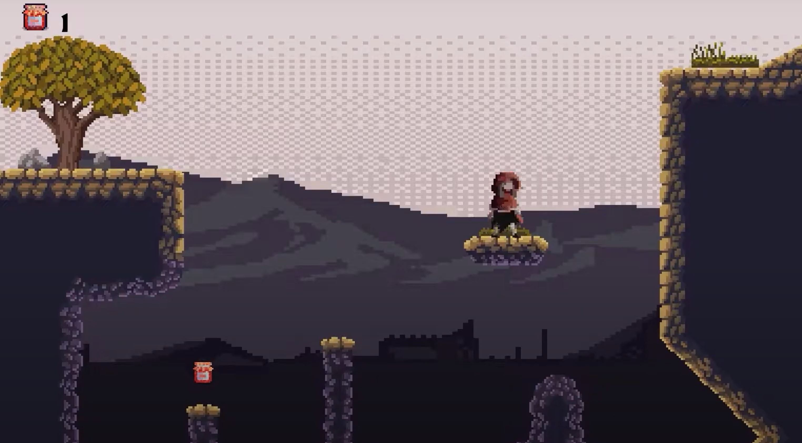

The Coastline introduces melee enemies to the player with simplistic pathing, allowing the player to developer strategies about how to best avoid damage. It also increases the difficulty of the platforming, with more precise jumps now necessary. 

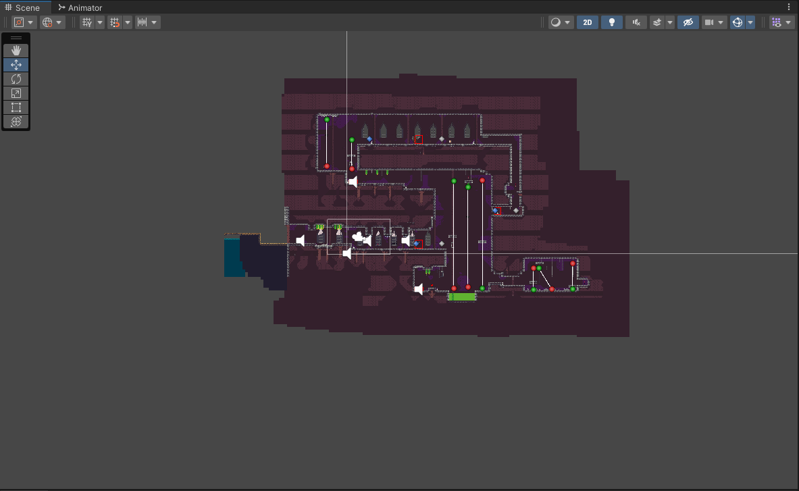
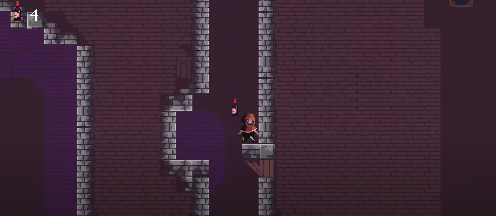

The Castle is a labyrinth the player must navigate to successfully find the next page. This level has more deadly melee enemies, along with environmental hazards such as spears, acid, and spike pits. The collectibles are more well hidden in secret areas and tunnels. One collectible is found in a obscured drop down tunnel that the player cannot fully access until later in the level, but it is hinted at by the placement of a skeleton enemy at the entrance. 

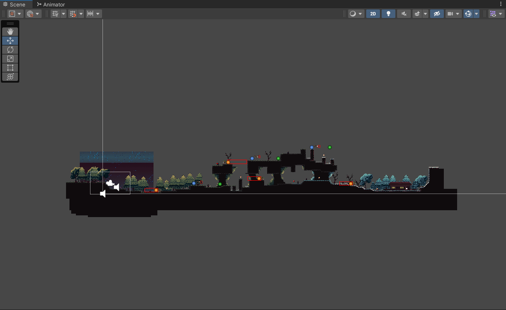

Finally, the Forest combines everything the player has experienced so far with a plethora of melee and projectile enemies, along with environmental hazards. Depending on the path the player takes, they might traverse through the thorny trees with hiding goblins, or jump above the trees with flying monsters. 

The collectibles found throughout the levels encourage the player to search through each level to find secrets and succeed in platforming challenges. 

Gallery
------


  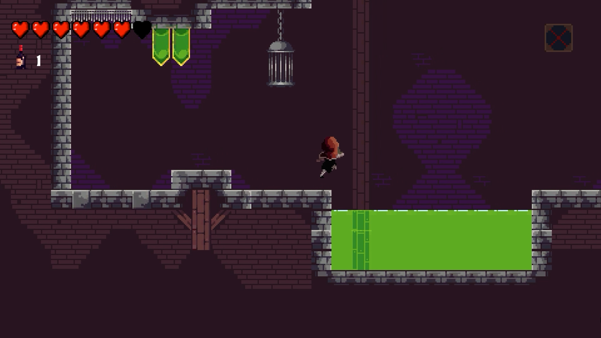
  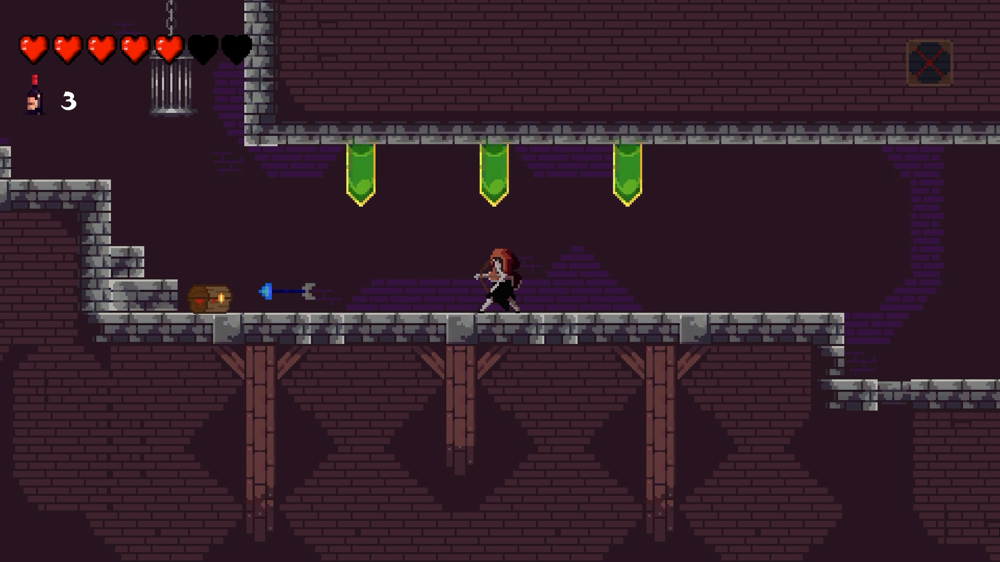
  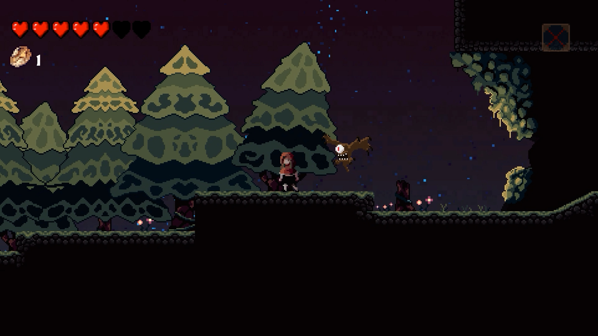
  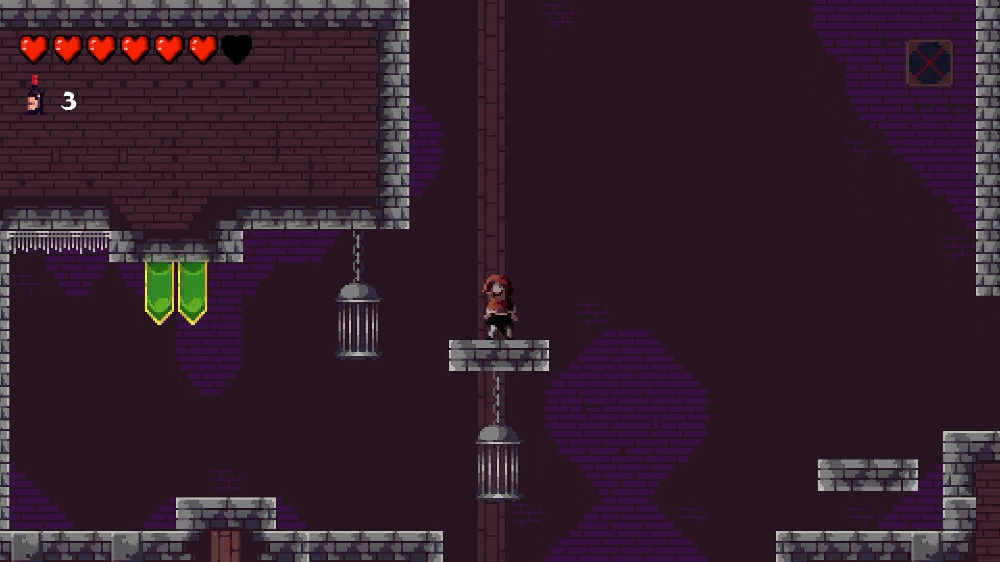
  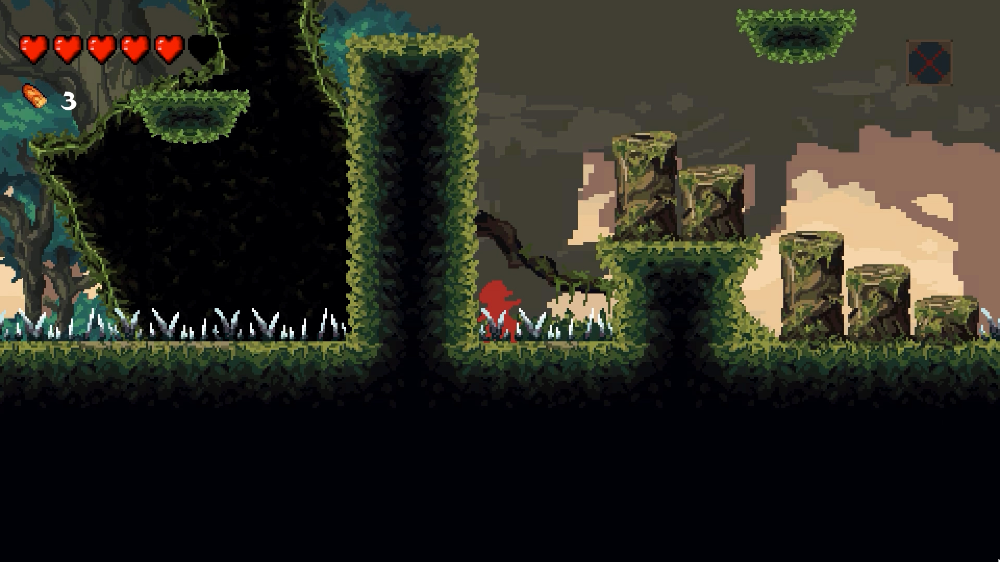
  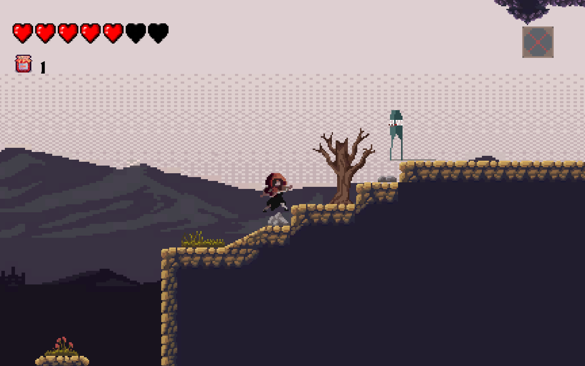
  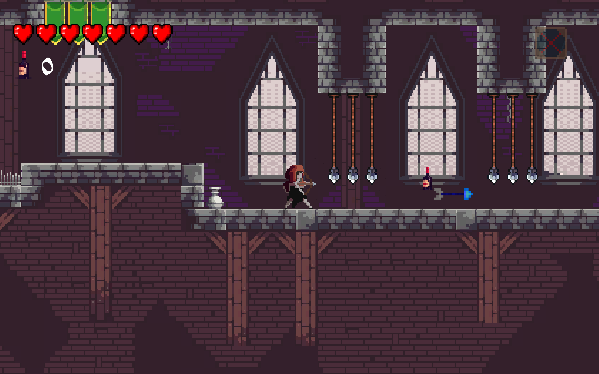
  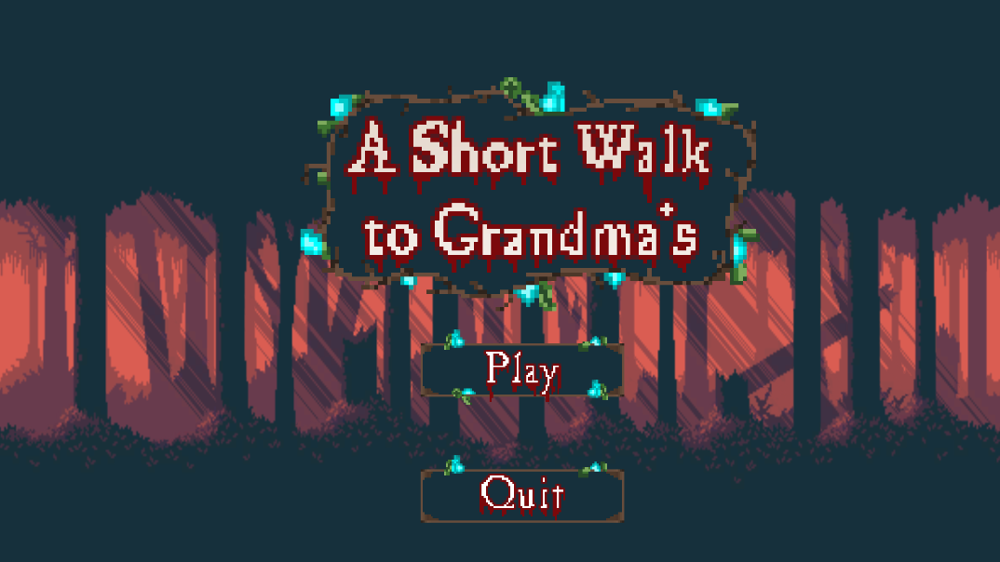
  


------

Check out [the game!](https://tofukiller.itch.io/a-short-walk-to-grandmas) on Itchio.
