+++
title = "Canyon Treasure"
date = 2023-05-01T13:03:09-05:00
draft = false
tags = ['Level Designer']

showDate = true
showDateUpdated = true
showHeadingAnchors = false
showPagination = false
showReadingTime = false
showTableOfContents = false
showTaxonomies = true 
showWordCount = false
showSummary = true
sharingLinks = false
+++

**Level Designer**   (*March 2023 -  May 2023*)

Level Sequence
------



Summary
------

*Canyon Treasure* is a level concept for a 3D action adventure open-world game where you play as a Treasure Hunter seeking the riches buried in the sands of the caves. Be warned! Bandits guard the entrances to these hidden treasure troves so you must be on your guard, and who knows what lurks in the deepest parts of the cave. 

This project was completed in two parts over several months: the linear dungeon level, and then combining that with the open world level. I really wanted to focus on using color, along with the environment, to push the player along naturally. There are multiple landmarks, and "a-ha!" moments throughout the level that reward player for their exploration, while also naturally guiding them to their next objective. 

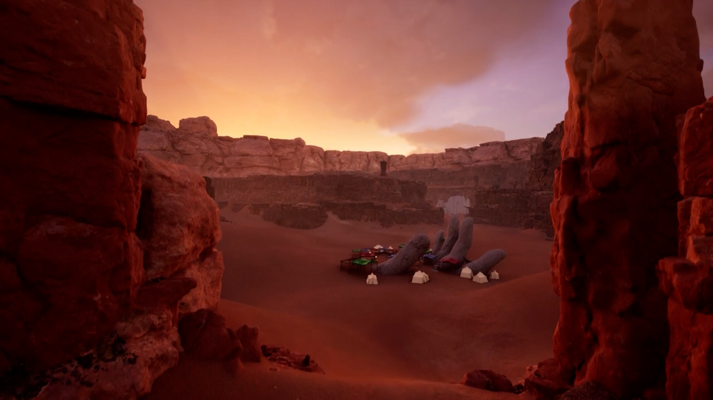

## Development

### Level Design

When I began work on the outside environment space, I sketched out the general flow and space proportions. I wanted a central area to draw the player in to serve as a hub world, and then to be naturally guided to the castle ruins. 

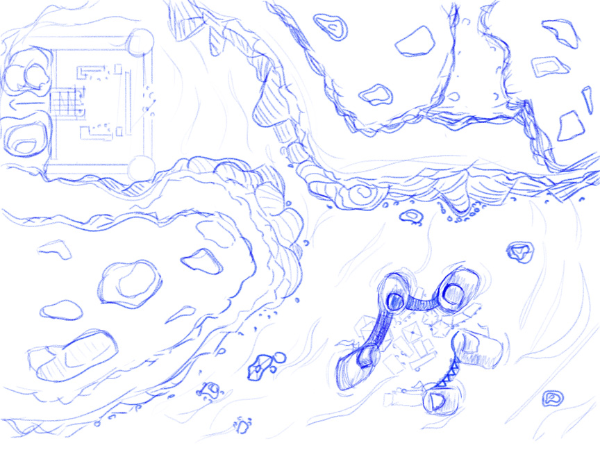

My goal for this project was to combine an open-world map that lead into a more linear dungeon. The initial starting area is wide and vast, with warm oranges and yellows for a comforting feel. Ancient statues that have been buried by the sands of time act as a landmark for players to lead them to the local Marketplace. Here, players could trade, buy, sell, and accept quests from NPCs. 

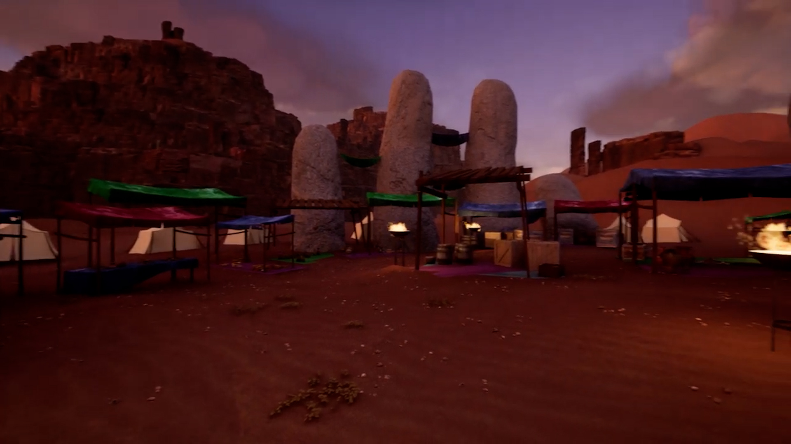

The environment then naturally guides the player towards their destination with the opening of the canyon, and the landmarks of the bandit camp at the throat of it. The player has different options for how they might want to deal with the bandits, taking a more stealthy approaching by coming around from the back by a visible path, or using the bandits' own traversal tools of ladders, ropes, and pulley systems. 

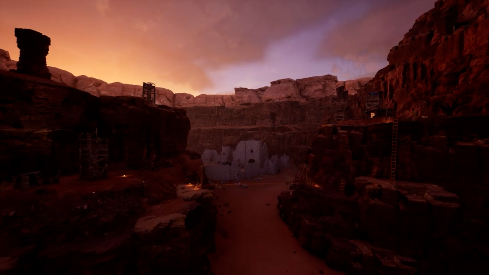

After passing through the castle ruins in the canyon, the player would navigate to a secret cave holder vast treasures.  The initial closed-off cave corridors force the player to feel more confined and to focus on their surroundings. They would have to solve a puzzle involving a mysterious rune on the far wall. Solving this, the player is rewarded visually with the grand focal point of the level, where players would then take part in a Raid-like encounter with a boss. 

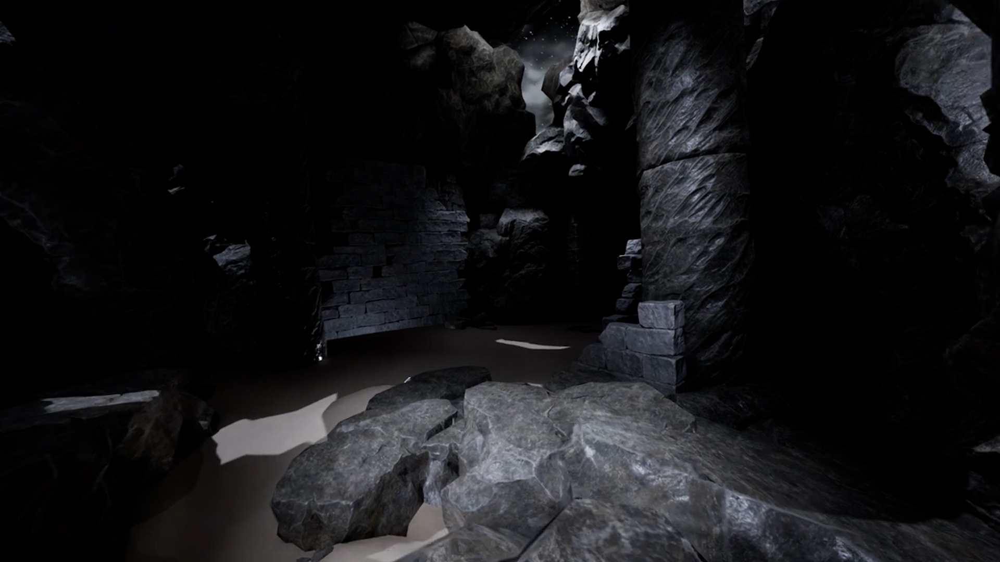
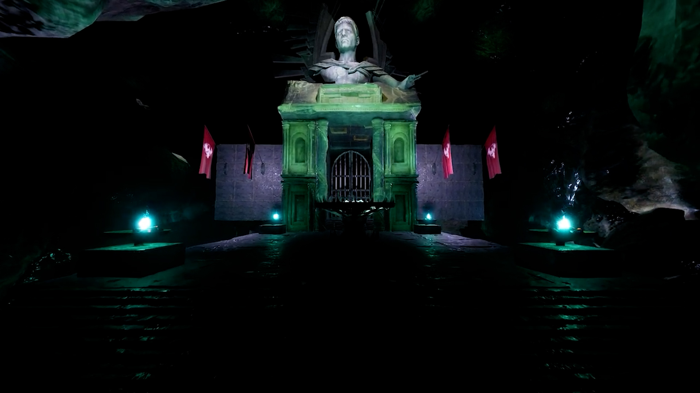

Gallery
------


  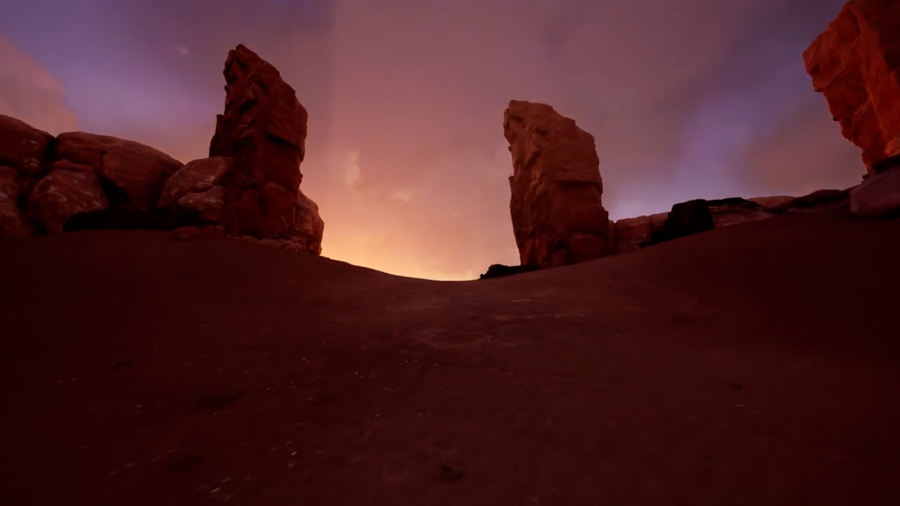
  
  
  
  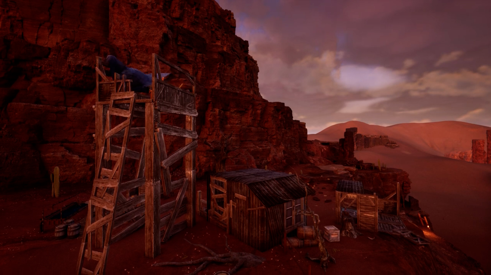
  
  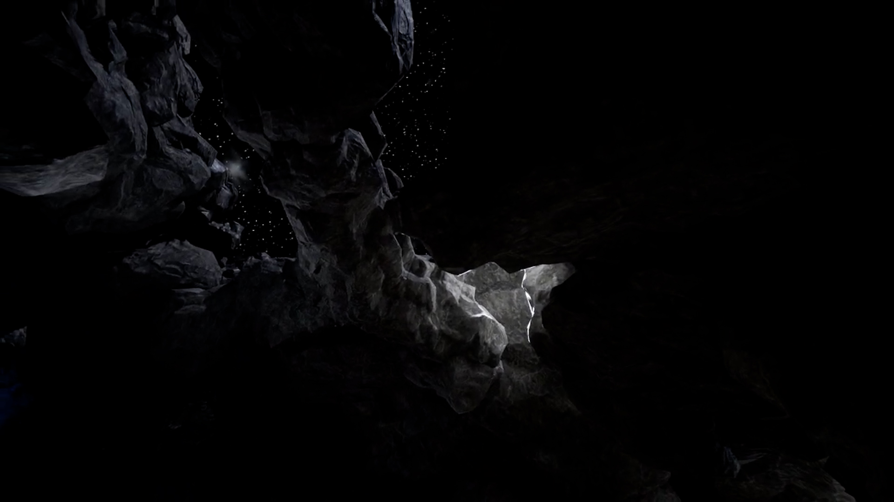
  
  
  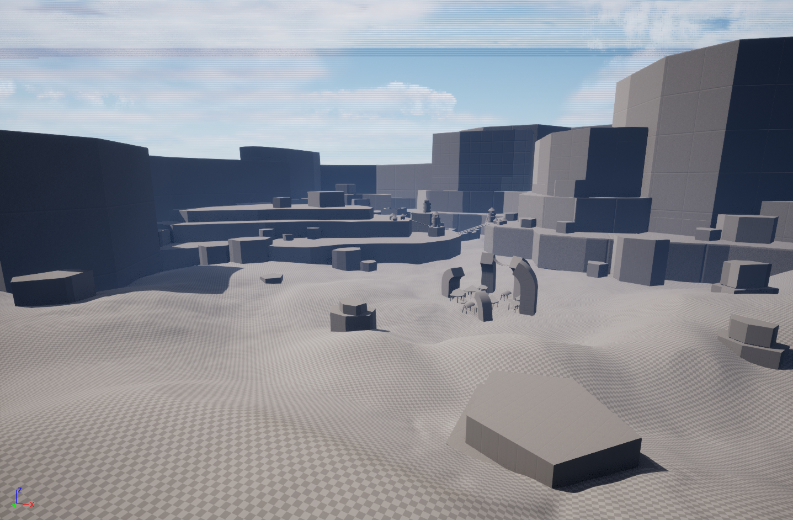
  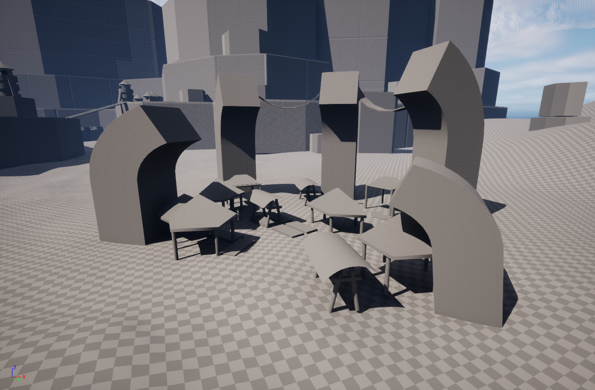
  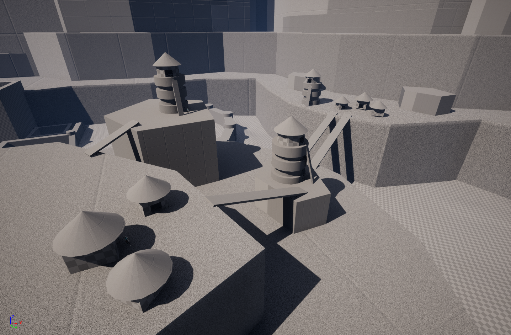
  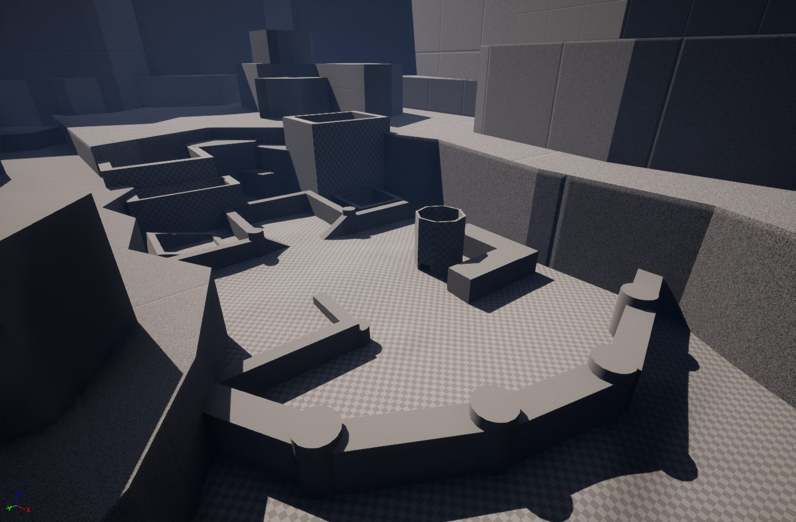
  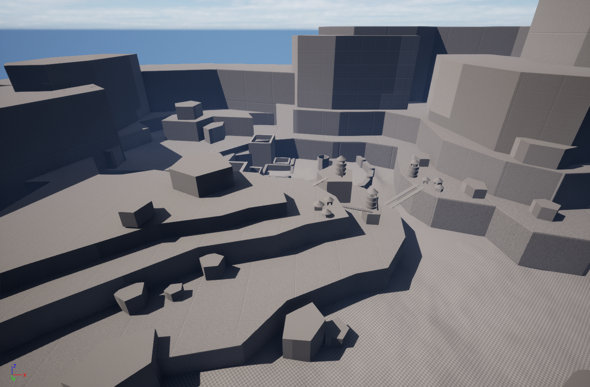
  
