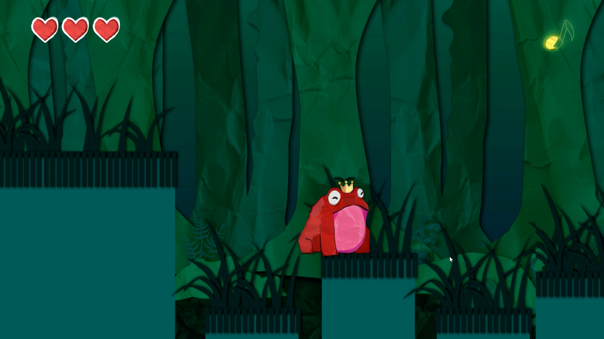

+++
title = 'Freedom Frogs'
date = 2021-04-12T14:10:07-05:00
draft = false

tags = ['Level Designer']

showDate = true
showDateUpdated = true
showHeadingAnchors = false
showPagination = false
showReadingTime = false
showTableOfContents = true
showTaxonomies = true 
showWordCount = false
showSummary = true
sharingLinks = false
+++

**Level Designer**
(*April 5th - April 12th, 2021*)

Summary
------

*Freedom Frogs* is a 2D rhythm platformer where you play as a Prince turned into a frog by the magical witch of the forest. Traverse through the forest collecting all parts of the frogs' song to the beat of the ever changing music and hopefully you live to croak another day!

I worked as the Lead Level Designer for this 2021 College Game Jam Submission. I worked remotely with 4 other people to design and implement the project in Unity. Out of 84 submissions, we placed 4th in the competition and received a prize for our efforts. The key element I followed in designing the levels for this project was creating sections where the player could test out and master each ability, and then a final section where they had to put it all together. 

Level Design
------

Early on I pitched the game mechanics of movement and abilities being tied to the beat of the music, and that the player would have to plan out their movement and attacks based on the changing beat. 

I created jumping sections in the level that have the player trying to navigate around enemies while also not falling in the water. However, if the player times their jump correctly, they can get an added bonus jump from jumping on top of the enemies. This is taught to the players early on with this fish level. 

As the player continues the level, they unlock new abilities that are used on the off-beat and up-beat of the song. This includes a tongue ability, which is useful for linear movement enemies like these beetles. This section teaches that to the player. 

Whenever the player gains a new ability, I used that section of the level to teach the player how to use that ability. This culminates in the ending area which utilizes all three abilities to traverse.

Gameplay and Developers Talk
------



Gallery
------


  
  
  
  
  
  
  


------


Check out [the game!](https://luckism.itch.io/freedom-frogs) on Itchio.
