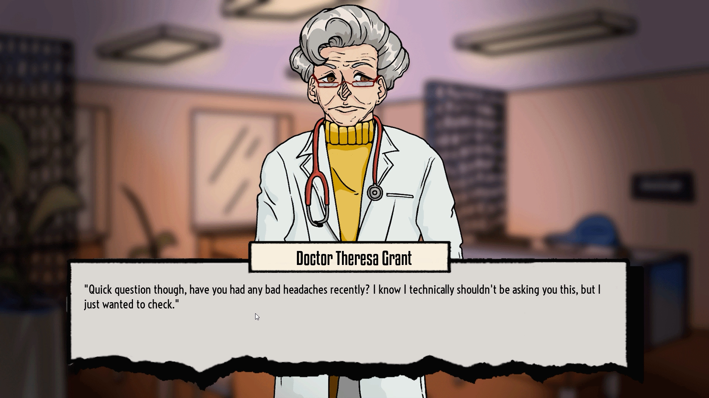
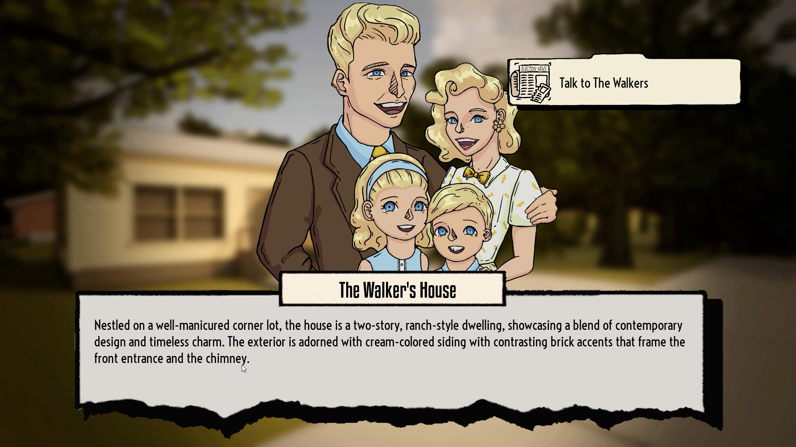

+++
title = 'Our Town'
date = 2023-12-29T14:10:07-05:00
draft = false

tags = ['Programmer', 'on-going']

showDate = true
showDateUpdated = true
showHeadingAnchors = false
showPagination = false
showReadingTime = false
showTableOfContents = true
showTaxonomies = true 
showWordCount = false
showSummary = true
sharingLinks = false
+++

**Lead Programmer & Technical Artist**   (*August 2023 - current*)

Trailer
------



Summary
------

Our Town is a single-player story-driven investigative horror game set in a small town in 1960's America. You have just arrived in a new town to start working as a newspaper deliverer. However, this seemingly ordinary town holds dark secrets beneath its surface. Deliver newspapers, talk to your neighbors, and explore locations to find evidence and clues as to what is going on in this town.

Our Town's gameplay consists of day, evening, and night cycles. At the start of each day, players will be able to read the daily paper, which consists of 1960s popular trends and stories about the town. During the day players will deliver newspapers to residents and chat with them. During the evening players have free roam of the town to explore and interact, and at night players can stake out special discovered locations to find evidence of the town’s terrifying mystery. Using newfound evidence, you can then ask the residents about your findings and further the mystery.  

What do you discover through your investigation? What seems like the perfect 1960s American Suburb, is the home of an ancient cosmic entity who controls and feeds on the town’s residents. The entity, like an angler fish, has been using the town to lure people in. You have to find a way to save everyone! But remember; curiosity is not without its consequences. If you aren’t careful, you just might be the next missing person in the paper.

## Development

### Programming

*Our Town* is an ongoing project which currently has a live demo out. I am the Lead Programmer and Technial Designer for the project working in Unreal Engine 5. Some of the key systems I have created for the game include but are not limited to: 

- Branching Dialogue Trees
- Dynamic Interaction System
- Physics-based Driveable Car
- Day-Night Cycle
- Multiple Endings

My main goal was programming these systems was to create a solid foundation that could be interated upon and improved over time while also being easy to use for artists and developers without having to access complex code and blueprinting. This particularly came into play with the dialogue system. 

*Our Town* is heavily dialogue driven, and as such, we needed a system that could easily handle the myriad of different options. Additionally, the writers and artists would need to access this system regularly and be able to quickly understand and implement their dialogue, particularly when it changes. The current system utilizes UE5's Behavior Tree System, along with custom Auxiliary Nodes that impact events based on the player's choices. The advantage of this system is that it provides a visual flow for developers to see how the dialogue might look and feel while playing, while also being simplistic enough that is can be improved and expanded upon with additional custom nodes.

### Atmosphere and Environment

Early on in development, we settled on a core aesthetic and themeing to the imagery of *Our Town.* We researched and utilized 1960's Americana imagery of advertisements and pop culture, which was vital for our artists and writers to bring the Town to life. While exploring, the player might read the daily paper which will have references to what is going on at that time in history, and townsfolk will use appropriate lingo and make references to recent events. This helped tremendously in creating aspects of technical art such as developing appropriate shaders, lighting, and model animations. 

All of these systems were created and tested based upon a pre-established [Game Design Document](https://docs.google.com/document/d/1PNbGHwb3d4OwsBt54fZowYx2zM2Q0PtfrDAUUiatf3c/edit?usp=sharing) which is being updated and changed as development continued. 

Gallery
------


  
  
  
  
  
  
  
  
  
  
  
  
  
  
  
  
  
  
  
  
  
  


------

Don't forget to check out [our demo](https://samvo04.itch.io/our-town) on Itchio.

