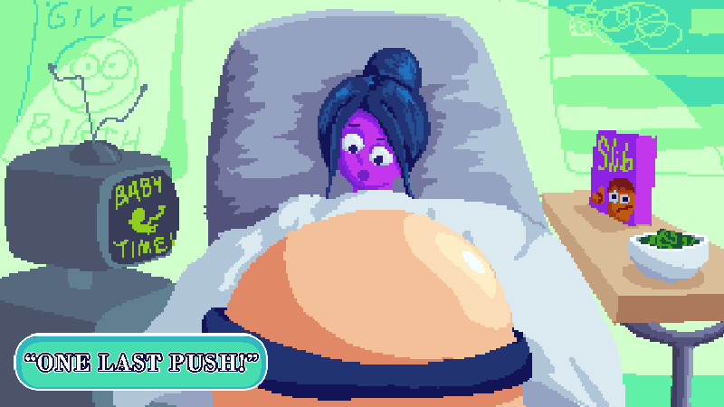

+++
title = 'Spit It Out!'
date = 2023-12-29T14:28:57-05:00
draft = false
tags = ['Programmer', 'on-going']

showDate = true
showDateUpdated = true
showHeadingAnchors = false
showPagination = false
showReadingTime = false
showTableOfContents = true
showTaxonomies = true 
showWordCount = false
showSummary = true
sharingLinks = false
+++

**Co-Director & Lead Programmer**
(*August 2023 - current*)



Summary
------

The future President of the United States needs your help! Help them learn the fundamentals of speaking and forming persuasive speeches that will move the hearts of millions. Work together as brain and body to complete puzzles and traverse levels.

*Spit It Out* is a split-screne co-op puzzle game where you and a friend (or foe) play as a Brain and Body cell inside the body of the future President of the United States. Each player must navigate through their own unique level, each utilizing a set of Gizmos: color-coded tools that affect the other player's level. The goal is to reach the end of each level, building up your speech skills with each passing level.

Story
------



## Development

### Co-Op

*Spit It Out*  takes inspiration from classic 2 player co-op games such as *Portal 2*, *Lego Starwars*, and *It Takes Two*. Our team focused early on in development in creating the ideal co-op gameplay loop that rewarded both players. We set out these main goals early on: 

1. No player should be waiting on the other player for more than around 5 - 10 seconds
2. Both players should be held equally accountable for their actions. No one player should be blamed for a mistake
3. Both players must affect the other player's gameplay to maintain co-op
4. The gameplay loop must be simple to understand and fun to iterate upon

We went through many different gameplay loop possibilities in trying to find something that held all four of these goals in the same regard. Eventually, we settled upon a 'tic-for-tac' loop, with each player having their own unique Gizmos that are used to help the *other* player progress through their environment by placing down Gizmos on wires that had immediate effects depending on player input. 

### Gizmos and Gadgets

After exploring and testing out several different gameplay loops to meet our criteria, we settled upon the final system of Gizmos and Gadgets: controllers and interactables that shape each player's environment to help them progress through the level. 

Each player has two unique gizmos such as a Lever and Slider, or a Crank and a Button. These can be placed down on Wires that exist throughout the environment that are color coded to specific Gadgets in the other player's section of the level. These gadgets might include something like a door, a seesaw, or a moving platform. Each player must use their limited number of Gizmos along with the variety of Gadgets in their environments to help one another traverse through obstacles. 

## Programming

### Gizmos and Gadgets
When designing and implementing the systems for *Spit It Out!* I wanted to create a system that could be iterated upon and expanded without having to make significant changes to the foundation of the system. The Gizmo-Gadget Interaction system would have to account for 4 different interactable Gizmos (Lever, Button, Crank, and Slider), their unique input systems (Lever and Button are a single button input, but slider and crank require two), the Wire system (placing a Gizmo on a wire should only affect certain colored wires), along with a system to create new Gadgets that can do a wide plethora of things like opening doors, toggling something to be solid or transparent, and moving platforms. It was a multi-step, compltex task that required a bit of planning to determine the best way to tackle it. 

I created an Interface (represented by the dotted cube) for the Interaction system. An Interface is not an instantiable class, but rather, it is a collection of properties and methods that serve as a skeleton for classes to inherit from. Those classes are then required to implement those properties and methods. This is useful as it makes it so that we do not have to inherit from a class that has very little to do with what we really need and standardizes functionality across a set of systems. 

This interface is then derived in our InteractableBase which sets and contains properties and methods such as the HoldDuration, whether or not an Object is Interactable, and whether it can be used multiple times. This interactable base is then placed on each of the objects that we wish to interact with, which is then referenced by the Interaction Controller the Player Character is utilizing. The InteractableBase also makes use of ScriptableObjects. We store our Gizmo Data in these scriptable objects which then gets fed to the Interaction Controller. 

These Gizmos then call upon specific methods that relate to their category. The Lever and Button are boolean, either being in the Up or Down position, while the Crank and Slider are floats with every changing value in a range of 0 to 1. These state values are then fed to a set List of Gadgets given by the Wire the Gizmo is active upon. All Gadgets take in a value of 0 to 1, and perform different functions depending on that value. With this method, dozens of new Gizmos and Gadgets could be implemented into the game, and be compatible with other Gizmos and Gadgets. 

### Split Screen Co-Op

The other major hurdle of *Spit It Out!* was implementing a Split Screen Co-Op system that kept track of the characters the players choose, attached those characters to the Controller IDs, and then keep that data throughout the entire game. Using the New Input System from Unity, I was able to create Input Controllers that are spawned in when the game first detects input from a controller. It then asks the player which character they want to play as, and then stores that information in a Game Instance that is not destroyed on load. This instance is then referenced throughout the entire game in correctly spawning in the player characters, and checking for input. 

Gallery
------


  
  
  
  
  
  
  
  
  
  
  
  
  
  
  
  
  
  
    
    
    
    
    
    
    
    
    
    
      



Don't forget to check out [our demo](https://chknlee.itch.io/spit-it-out) on Itchio.
